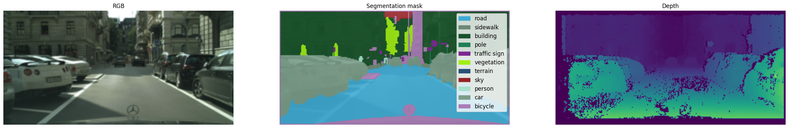
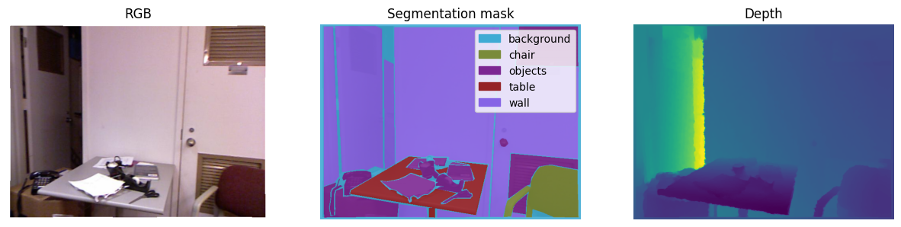

Multi-task learning for scene understanding
==============================

Multi-task learning (MTL) is an emerging approach in the field of machine learning, characterized by its ability to simultaneously address several related tasks, thereby enhancing learning efficiency and performance. This work explores some methodologies for MTL in the context of machine perception. The **main goal** is to study some of the models that represent different paradigms in MTL by implementing and evaluating them on established benchmarks.

## Models

Following the taxonomy of MTL models outlined in [1], the following classes of architectures are implemented:

- Hard parameter sharing, a shared backbone with shallow task-specific heads.
- Soft parameter sharing, **Cross-Stitch Networks**, Misra, I., Shrivastava, A., Gupta, A., & Hebert, M.  [Cross-Stitch Networks for Multi-task Learning](https://arxiv.org/abs/1604.03539). CVPR, 2016.
- Modulation & adapters, **MTAN**, Liu, S., Johns, E., & Davison, A. J.  [End-to-End Multi-Task Learning with Attention](http://arxiv.org/abs/1803.10704). CVPR, 2019.

## Data

The models are trained and evaluated on the following datasets:

- [Cityscapes](https://www.cityscapes-dataset.com/) downloaded from [here](https://www.kaggle.com/datasets/sakshaymahna/cityscapes-depth-and-segmentation/data)
- [NYUv2](https://cs.nyu.edu/~silberman/datasets/nyu_depth_v2.html) downloaded from multiple sources (see `data_modules/nyuv2.py` and the [original loader](https://github.com/xapharius/pytorch-nyuv2/tree/master))

The chosen tasks are **semantic segmentation** and **depth estimation**. Both tasks are formulated as a dense prediction problem, where the prediction is of the same spatial dimensions as the input image. Semantic segmentation is a pixel-wise classification problem, where each pixel is assigned a class label without considering different instances of the same class.
In depth estimation the network solves a pixel-wise regression problem, where each pixel is assigned a depth value from a predefined continuous range.

### Cityscapes

Cityscapes covers a set of urban street scenes from 50 different cities, offering a benchmark for outdoor scene understanding. The dataset contains 8925 training samples and 1500 validation samples. The images are of size 128x256. The semantic segmentation task has 19 classes, while depths are represented as relative values ([inverse depth](https://robotics.stackexchange.com/questions/6334/what-is-inverse-depth-in-odometry-and-why-would-i-use-it)) in the range [0, 1].

Sample input:



### NYUv2

NYUv2 is a dataset for indoor scene understanding. Coming in multiple versions, the one used in this work contains 795 training and 654 validation samples. The images are of size 480x640. There are 13 classes for semantic segmentation and depths are represented as absolute values in the range [0, 10].

Sample input:



## Pre-requisites

### Environment

- python >= 3.9
- (optional) `conda create -n mtl python=3.9`
- `pip install -r requirements.txt`

### Other

- (optional) Comet ML account for experiment tracking (see [here](https://www.comet.ml/docs/python-sdk/quickstart/)
- `vision_mtl/.env` file of the form:

```
comet_api_key=your_comet_api_key
comet_username=your_comet_username
```

## Imlementation details

### Training

The models are implemented in PyTorch. They are trained and evaluated on the task of semantic segmentation and depth estimation. A single GPU with 8Gb of memory is used for the experiments. The models are wrapped in the module from PyTorch Lightning, but due to this [issue](https://github.com/Lightning-AI/pytorch-lightning/issues/19216) the optimization loop is manual instead of using the `Trainer` from this library.

Entry point for the pipeline is `training_lit.py`. `utils.py` contains arguments for the command line.

To train a hard parameter sharing model ("basic") with weights pretrained on Imagenet, a sample command could be:

```
python training_lit.py --do_plot_preds --exp_tags test --num_workers=4 --batch_size=8 --val_epoch_freq=1 --save_epoch_freq=5 --num_epochs=20 --lr=5e-4 --model_name=basic --backbone_weights imagenet
```

For CSNet the `model_name` argument is `csnet`, while for MTAN it is `mtan`. These two models do not support pretrained weights and should be trained from scratch.

Metrics, images, session, and model checkpoints are logged to Comet ML according to the `LoggerConfig` setup in `cfg.py`. Metrics are also logged to Tensorboard under the local `lightning_logs` directory.

For Cityscapes, the `num_epochs` is set to 20, while for NYUv2 it is 50. For both datasets, the training set is split into training and validation sets with a ratio of 0.8.

Scripts to train the models are provided in the `scripts` directory.

### Metrics

For semantic segmentation, the following metrics are used:

- accuracy, with `threshold=0.5`
- Jaccard index, with `threshold=0.5`
- F-beta score, with `beta=1, threshold=0.5, average='weighted'`

For depth estimation only mean absolute error (MAE) is used.

### Losses

[Cross-entropy loss](https://pytorch.org/docs/stable/generated/torch.nn.CrossEntropyLoss.html) is used for semantic segmentation and [scale-invariant log loss](https://hiddenlayers.tech/blog/the-mystery-of-silog-loss/) is used for depth estimation.

### Models

The models are aligned in terms of the number of parameters and amount to approximately 13.3M parameters.

The models are not tailored to match the performance claimed in the original papers, but rather to explore how different MTL paradigms perform on the chosen tasks under the same setup and without any tuning (except for the case of hard parameter sharing).

#### Hard parameter sharing

Hard parameter sharing denotes MTL methods where a large portion of the network is shared between tasks and each task defines its own output layers. The shared part - the backbone - is forced to learn a generalizable representation that is useful for all tasks at once, while individual task heads ensure specialization for each task.

A basic model that shares the backbone between the tasks and has shallow one-layer heads for each task to get task-specific predictions.

The backbone is the `timm-mobilenetv3_large_100` model from the `segmentation_models_pytorch` library with **pretrained Imagenet weights**.

Files:

- `models/basic_model.py`

#### Hard parameter sharing with tuned loss weights

To increase the performance of an MTL model, one can try to optimize the loss weights that scale contributions of individual tasks to the total loss. One of the methods for this hyperparameter tuning could be Bayesian optimization. The proxy objective in this case is to maximize the mean accuracy on the semantic segmentation task on the validation set. There are 15 trials, each trial lasting for three training epochs.

Files:

- `training_lit.py`

#### Soft parameter sharing

Soft parameter sharing in MTL refers to a method where each task has its own set of parameters, but these sets are regularized to be similar to each other. The objective is to allow each task to learn its own specialized representation while still benefiting from the knowledge contained in other tasks. This approach contrasts with hard parameter sharing, where tasks directly share a common set of parameters.

The implemented model is based on the Cross-Stitch Networks architecture. It implements both channel-wise and layer-wise cross-stitching.

Embedding cross-stitching units in an architecture for MTL allows bypassing expensive architecture search for the best way to share parameters between tasks. In the end-to-end training, the cross-stitching units learn to share information between tasks at different levels of the network. Layer-wise stitching defines a linear combination of the activations of the tasks at a given layer, while channel-wise stitching works at the more granular level of channels. Visual representation of the stitching idea is shown in [2].

The model consists of networks for each task and cross-stitching units that connect them. The backbone is the `timm-mobilenetv3_large_100` model with weights pretrained on Imagenet.

Files:

- `models/cross_stitch_model.py`

#### Modulation & adapters

The model is based on the MTAN (Multi-Task Attention Network) architecture. Every task has its own subnetwork which can be viewed as a task-specific feature extractor that receives as input weights from the main network which is a global feature extractor. This approach promotes generalizability in the global network, while learning high-quality task-specific features [5].

The model is built with a custom UNet backbone inspired by [3]. Please refer to [4] for the official implementation.

Files:

- `models/mtan_model.py`

## Results

### Using trained models

Weights of the trained models as well as CLI arguments for training are available for download from Google Drive:

| | Cityscapes | NYUv2 |
|:---|:---:|:---:|
| [Google Drive](https://drive.google.com/drive/folders/1mYasCMG0rRmwL89hDWKKnIuDp4oi64vu?usp=sharing) | [Google Drive](https://drive.google.com/drive/folders/1lY0gtYrb8deWwzfkIn4M5NpOOYPKuxI4?usp=sharing)

An example on how to use these artifacts can be found in `notebooks/get_model_metrics.ipynb`.

Aggregated metrics obtained on the validation set of `Cityscapes`:

| Metrics       |   HS | HS (P) |   HS_tuned_loss_weights (P) |   CSNet (P) |   MTAN |
|:--------------|-----------------------:|--------:|--------------:|--------:|-------:|
| Loss          |                  4.537 |   **3.395** |         4.455 |   5.912 |  3.633 |
| Accuracy      |                  0.805 |   0.856 |         0.783 |   0.753 |  **0.86**  |
| Jaccard index |                  0.279 |   0.358 |         0.248 |   0.222 |  **0.385** |
| F-beta score  |                  0.795 |   0.851 |         0.77  |   0.731 |  **0.856** |
| MAE           |                  0.043 |   0.045 |         **0.041** |   0.057 |  0.06  |

where:

- (P): pretrained weights on Imagenet
- HS: hard parameter sharing model
- HS_tuned_loss_weights: hard parameter sharing with pretrained weights and optimized loss scales

MTAN and pretrained hard parameter sharing model achieved comparable results and consistently outperformed other models. MTAN performs best on all the metrics related to semantic segmentation, but shows the worst performance on the depth estimation task. This indicates that the default task balancing strategy (loss weights, capacity of task-specific subnetworks) is suboptimal for this model. Hard parameter sharing models perform better than the soft parameter sharing model in terms of all the metrics. The tuned hard parameter sharing model performs better on depth estimation (and segmentation) than a vanilla one, although the optimization objective included only accuracy on the segmentation task.

Aggregated metrics obtained on the validation set of `NYUv2`:

| Metrics       |   HS | HS (P) |   HS_tuned_loss_weights |   CSNet |   MTAN |
|:--------------|-----------------------:|--------:|--------------:|--------:|-------:|
| Loss          |                  **4.893** |   4.904 |         6.048 |   5.978 |  5.759 |
| Accuracy      |                  **0.511** |   0.508 |         0.329 |   0.411 |  0.501 |
| Jaccard index |                  **0.226** |   0.222 |         0.109 |   0.136 |  0.223 |
| F-beta score  |                  **0.501** |   0.496 |         0.307 |   0.366 |  0.483 |
| MAE           |                  **0.049** |   0.05  |         0.079 |   0.083 |  0.073 |

Contrary to the previous case, the best performance on NYUv2 is achieved by the hard parameter sharing models with and without pretraining, as both models arrived at numbers with negligible difference. MTAN is the runner-up with a substantial drop in the metrics related to depth estimation. Since it was also worse in the MAE for Cityscapes, balancing out segmentation and depth, e.g., via loss weighting, could lead to an improvement. The HS network trained with tuned loss weights performs better than the vanilla one which is in line with the results on Cityscapes.

## Summary

Overall, the results show that the simplest approach - hard parameter sharing - is competitive with more complex models, although it is not flexible enough to achieve the best performance consistently across different datasets. Usage of pretrained weights helps to improve the performance of the model, but the effect could be diminished by the domain drift between the pretraining and the target dataset (e.g., Imagenet vs NYUv2). Hyperparameter tuning of the loss weights could be a viable strategy to improve the performance, but the optimization objective should be carefully chosen to account for multiple tasks.

Soft parameter sharing, aiming to offer better generalization than hard parameter sharing, does not show a clear advantage, which could be due to the fact that its default configuration is suboptimal for the chosen cases. The MTAN model, which is the most complex out of the three, shows promising results, but similar to the soft parameter sharing model, it requires tuning of the subnetworks and more fine-grained task balancing to achieve the best performance.

## References

[1] ["Awesome" list for multi-task learning](https://github.com/Manchery/awesome-multi-task-learning)

[2] [Tensorflow implementation of the cross-stitch network](https://github.com/helloyide/Cross-stitch-Networks-for-Multi-task-Learning)

[3] [UNet architecture implementation](https://github.com/milesial/Pytorch-UNet/tree/master)

[4] [Official implementation of MTAN](https://github.com/lorenmt/mtan)

[5] [MTAN project page](https://shikun.io/projects/multi-task-attention-network)
